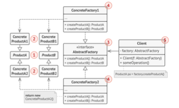

## Abstract Factory
He implementado un patrón de diseño que nos permite crear una variedad de objetos a partir de una plantilla.

En este caso se trata de una factoría de muebles que tiene dos tipos de acabados:

- Modern
- Victoria

En la clase Client, dependiendo lo que elija el cliente se muestran algunos de los 
comportamientos de los muebles ;-)

# UML Diagram
He seguido este diagrama base para implementar el código
