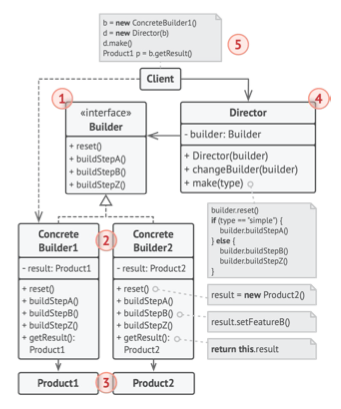

## Builder
El uso del patrón Builder sólo tiene sentido cuando tus
productos son bastante complejos y requieren una
configuración extensiva. Los dos siguientes productos están // relacionados, aunque no tienen una interfaz común.

# UML Diagram
He seguido este diagrama base para implementar el código
