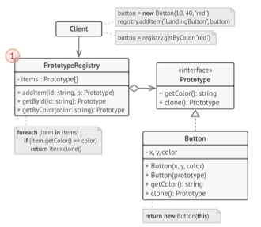

## Prototype - Clonar

En este ejemplo, el patrón Prototype nos permite producir copias exactas de objetos geométricos sin acoplar el código a sus clases.

# UML Diagram
He seguido este diagrama base para implementar el código

La interfaz **Prototipo** declara los métodos de clonación. En la mayoría de los casos, se trata de un único método clonar.

La clase **Prototipo Concreto** implementa el método de clonación. Además de copiar la información del objeto original al clon, este método también puede gestionar algunos casos ext- remos del proceso de clonación, como, por ejemplo, clonar ob- jetos vinculados, deshacer dependencias recursivas, etc.

El **Cliente** puede producir una copia de cualquier objeto que
siga la interfaz del prototipo.

El **Registro de Prototipos** ofrece una forma sencilla de acceder a prototipos de uso frecuente. Almacena un grupo de objetos prefabricados listos para ser copiados. El registro de prototipos más sencillo es una tabla hash con los pares
name → prototype. No obstante, si necesitas un criterio de búsqueda más preciso que un simple nombre, puedes crear una versión mucho más robusta del registro.
